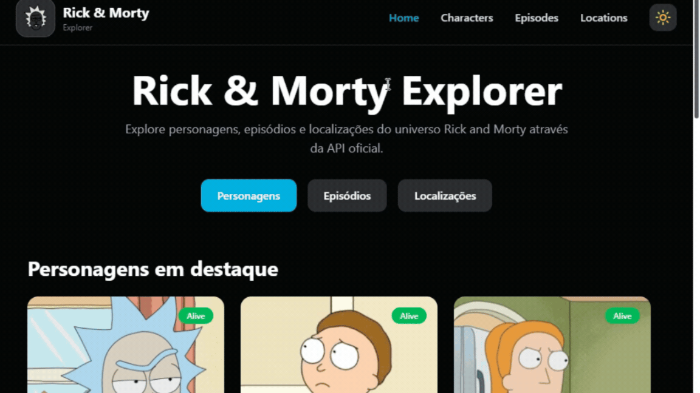

# Rick and Morty Explorer

<p align="center">
  
</p>

Aplicação web desenvolvida como solução para um desafio técnico utilizando **React**, **TypeScript**, **Vite**, **Tailwind CSS** e a **Rick and Morty API**.

O projeto permite explorar personagens, episódios e localizações do universo Rick and Morty através de uma interface responsiva, com busca, filtros, paginação, páginas de detalhes, recomendações e modo escuro.

### Demonstração

https://desafio-frontend-ashen-omega.vercel.app/

---

## Sumário

- [Tecnologias](#tecnologias)
- [Decisões de arquitetura](#decisões-de-arquitetura)
- [Como executar o projeto](#como-executar-o-projeto)
- [Funcionalidades](#funcionalidades)
- [Rotas disponíveis](#rotas-disponíveis)
- [Tratamento de estados](#tratamento-de-estados)
- [Diferenciais implementados](#diferenciais-implementados)

---

# Tecnologias

- React
- TypeScript
- Vite
- Tailwind CSS
- React Router DOM
- Axios
- ESLint
- Prettier

---

# Decisões de arquitetura

Durante o desenvolvimento foram adotadas algumas decisões para manter o projeto organizado, reutilizável e de fácil manutenção.

- Componentização da interface;
- Separação das chamadas HTTP em uma camada de Services;
- Tipagem completa utilizando TypeScript;
- Organização das páginas por domínio;
- Layout compartilhado entre as páginas;
- Centralização das rotas da aplicação;
- Hook personalizado para gerenciamento do tema;
- Separação de constantes e utilitários;
- Componentes reutilizáveis para listagens, filtros e navegação.

---

# Como executar o projeto

## Pré-requisitos

É necessário possuir instalado:

- Node.js;
- npm ou yarn.

## Instalação

Clone o repositório:

```bash
git clone https://github.com/miguelrsant/desafio-frontend.git

cd desafio-frontend
```

Instale as dependências:

```bash
npm install
```

Execute a aplicação:

```bash
npm run dev
```

A aplicação estará disponível em:

```text
http://localhost:5173
```

---

# Funcionalidades

A aplicação permite:

- Visualizar personagens;
- Pesquisar personagens por nome;
- Filtrar personagens por status e espécie;
- Navegar entre páginas de resultados;
- Visualizar detalhes dos personagens;
- Visualizar episódios;
- Visualizar detalhes dos episódios;
- Visualizar localizações;
- Visualizar detalhes das localizações;
- Receber recomendações relacionadas;
- Alternar entre tema claro e escuro;
- Navegar por uma página 404 personalizada quando uma rota não existir.

---

# Rotas disponíveis

| Rota              | Descrição                |
| ----------------- | ------------------------ |
| `/`               | Página inicial           |
| `/characters`     | Listagem de personagens  |
| `/characters/:id` | Detalhes do personagem   |
| `/episodes`       | Listagem de episódios    |
| `/episodes/:id`   | Detalhes do episódio     |
| `/locations`      | Listagem de localizações |
| `/locations/:id`  | Detalhes da localização  |
| `*`               | Página não encontrada    |

---

# Tratamento de estados

A aplicação contempla diferentes estados para melhorar a experiência do usuário.

### Loading

Enquanto os dados são carregados:

- Feedback visual ao usuário;
- Evita renderizações incompletas.

### Erros

Quando um recurso não é encontrado:

- Exibe uma mensagem informativa;
- Mantém recomendações disponíveis;
- Evita interromper a navegação.

### Valores desconhecidos

Valores retornados pela API como:

```text
unknown
```

são exibidos como:

```text
Desconhecido
```

mantendo o valor original internamente para filtros e requisições.

---

# Diferenciais implementados

Além dos requisitos propostos no desafio, foram implementadas melhorias visando uma arquitetura mais próxima de aplicações reais.

- Interface responsiva;
- Dark Mode;
- Componentes reutilizáveis;
- Arquitetura organizada em camadas;
- Separação da comunicação com a API em Services;
- Tipagem completa utilizando TypeScript;
- Tratamento de estados de carregamento e erro;
- Página 404 personalizada;
- Paginação integrada à API;
- Recomendações de conteúdo relacionadas;
- Formatação de dados para melhor experiência do usuário;
- Padronização do código utilizando ESLint e Prettier.
